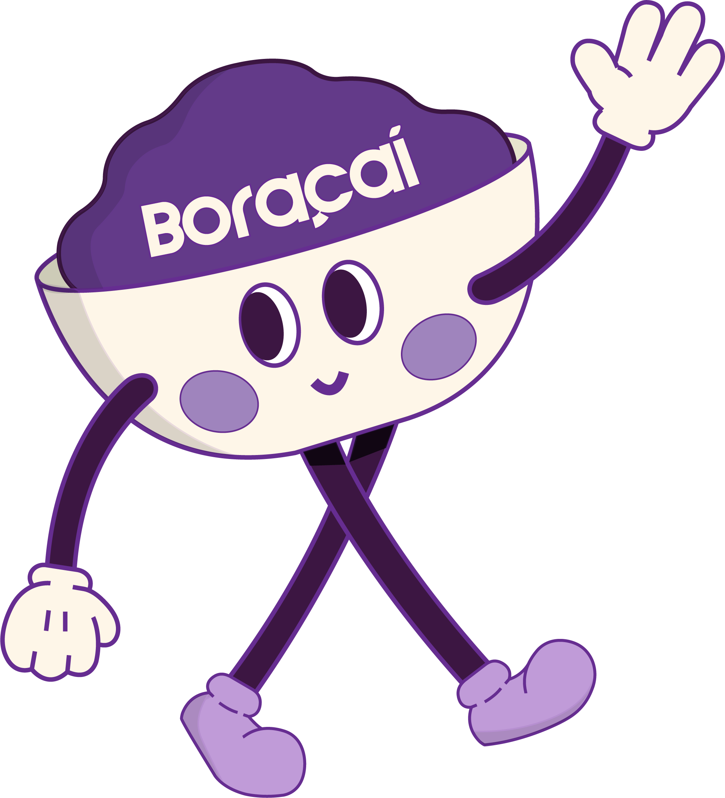
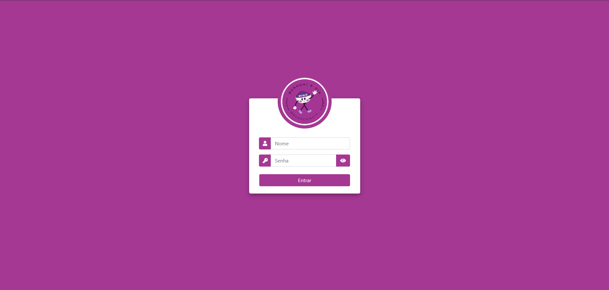
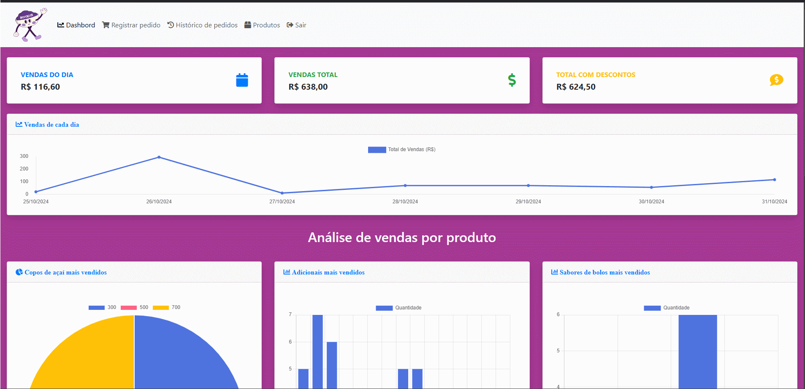
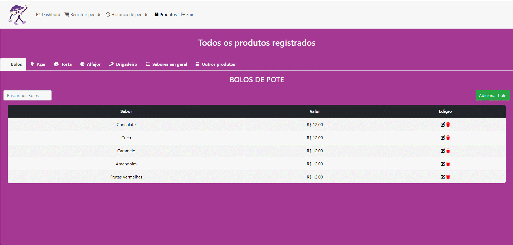
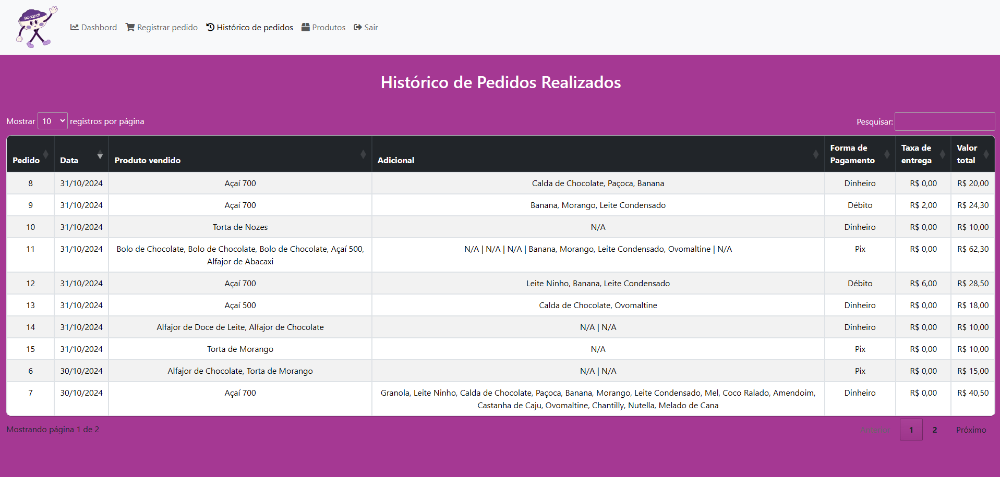

<h1 align= "center">

</h1>

# Boracai

## 📕 Sobre o projeto

**Boracai** é um projeto criado para uso pessoal em que ajuda no gerenciamento e controle de vendas. Podendo ver detalhadamente os produtos vendidos, realizar novas vendas, além de acessar relatórios precisos e o histórico completo dos pedidos realizados. Esta ferramenta visa facilitar a tomada de decisões e aprimorar o desempenho operacional, oferecendo uma visão clara e organizada dos dados de vendas.

## 🔨 Tecnlogias usadas

- HTML
- CSS
- JavaScript
- PHP
- phpMyAdmin
- Bootstrap como framework

## 💻 Imagens do projeto

### Login

### Tela inicial / Dashbords
Nesta tela, são exibidos dados importantes, como as vendas do dia, o total de vendas acumuladas, as vendas com descontos (considerando as taxas de cartões e do iFood), além dos produtos mais vendidos em cada categoria. Essa visualização proporciona uma compreensão abrangente do desempenho de vendas e auxilia na identificação de tendências e oportunidades de melhoria.

### Produtos
Nesta tela, é possível ver os produtos no sistema, além também de adicionar, remover ou editar um produto já cadastrado.

### Venda
Nesta tela, é realizado a venda do produto.

### Historico
Nesta tela, é exibido todo o histórico de pedidos realizados.

## Conclusão
O projeto foi criado com o objetivo de facilitar o controle de vendas, eliminando a necessidade de anotar informações manualmente em papel e realizar cálculos complicados. O sistema foi desenvolvido atendendo as solicitações da proprietária do estabelecimento, e tem sido aprimorado ao longo do tempo com base nas necessidades e feedback.